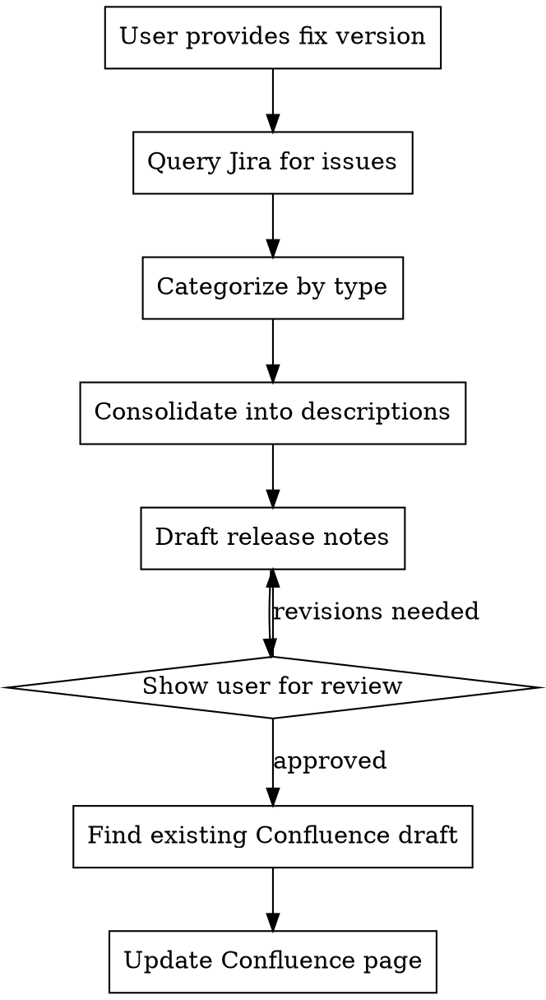

# Mobile Release Notes Generator

## Overview

Generate release notes for SPIE mobile app releases by querying Jira for issues in a fix version and creating/updating a Confluence page with consolidated, user-friendly descriptions.

## When to Use

- User requests release notes for a fix version (e.g., "create release notes for 26.01")
- User invokes `/release-notes <version>`

## Workflow



### Step 1: Query Jira

Use JQL to get all issues for the fix version:
```
fixVersion = "<version>" AND project = MOB ORDER BY priority DESC
```

Extract: key, summary, description, issuetype.name, priority.name

### Step 2: Categorize Issues

| Issue Type | Release Notes Section |
|------------|----------------------|
| New Feature | New Features |
| Improvement | Improvements |
| Bug | Improvements |
| Task | Improvements (if user-facing) |
| Sub-task | Usually skip unless significant |

**Special cases:**
- Issues with component "CVE" or "Vulnerability" → Security Updates
- Internal/technical tasks (build pipeline, refactoring) → Usually omit or summarize briefly

**To find security issues, run a separate JQL query:**
```
fixVersion = "<version>" AND project = MOB AND component in (CVE, Vulnerability)
```

### Step 3: Consolidate Descriptions

**DO NOT** list every ticket verbatim. Instead:
- Group related fixes (e.g., multiple iOS crash fixes → "Several crash-causing issues have been fixed on iOS")
- Write user-facing descriptions (what changed for the user, not technical details)
- Combine platform-specific fixes when the fix is the same (e.g., "YouTube videos now play correctly.")

### Step 4: Write with Style

**Tone:** Professional but with personality. Add occasional humor/flair.

**Good examples from past releases:**
- "Welcome back, we missed you!" (after fixing crash on resume)
- "Monday means Monday now." (after fixing day navigation)
- "What happens in BiOS stays in BiOS." (after fixing symposium filtering)
- "Battery life thanks you." (after fixing camera not turning off)
- "One less tap, infinite more joy." (after adding auto-submit)
- "Robots testing robots - the future is now." (after adding UI tests)

**Structure uses Confluence colored panels:**

| Section | Panel Color | Icon | When to Include |
|---------|-------------|------|-----------------|
| **Overview** | Blue/purple (info) | ℹ️ | Always |
| **New Features** | Pink/magenta (note) | 🟥 | If any New Feature issues |
| **Improvements** | Green (success) | ✅ | If any bugs/improvements |
| **Security Updates** | Yellow (warning) | ⚠️ | Only if CVE issues exist |

**Content structure:**
```
[Blue Info Panel - Overview]
Release XX.XX [brief description]. [1-2 highlight sentences].

Android version: TBD
iOS version: TBD
Mobile Task version: TBD

[Pink Note Panel - New Features]
• Feature 1 description with optional flair
• Feature 2 description

[Green Success Panel - Improvements]
• Improvement 1
• Improvement 2

[Yellow Warning Panel - Security Updates] (omit if no CVEs)
• CVE-XXXX description
```

**Version numbers:** Leave as TBD - user will fill in.

### Step 5: Update Confluence Page (ADF Format)

**Workflow:** User creates the page from the template first, then this skill updates it with content.

1. **Find the draft page** - Search descendants of parent page ID 2967371785 for pages matching release version
   - Filter by `status: "draft"` first (user typically creates drafts before release)
   - Match version number in title (e.g., "Release 26.02" matches version "26.02")
   - If multiple matches, prefer the most recently created draft
2. **Confirm with user** - Show the page title and ID found, ask user to confirm before updating
3. **Fetch existing page in ADF format** - Use `getConfluencePage` with `contentFormat: "adf"` to preserve widgets/macros
4. **Build new ADF content** - Construct panels with content, add Jira widget at end
5. **Update the page** - Use `updateConfluencePage` with `contentFormat: "adf"`

**Configuration:** Read Atlassian settings from `config.local.md` in this skill directory.

**Title format:** `YYYY-MM-DD: Release XX.XX` or `YYYY-MM-DD: Release XX.XX.X` for minor releases

**Important:** Ask user to confirm the page exists before attempting to update. If no page exists, ask them to create one from the template first.

## ADF Panel Structure

Use these panel types in ADF format:

| Section | panelType |
|---------|-----------|
| Overview | `info` |
| New Features | `note` |
| Improvements | `success` |
| Security Updates | `warning` |

**ADF Panel Template:**
```json
{
  "type": "panel",
  "attrs": {"panelType": "<type>"},
  "content": [
    {
      "type": "paragraph",
      "content": [{"type": "text", "text": "<Section Title>", "marks": [{"type": "strong"}]}]
    },
    {
      "type": "bulletList",
      "content": [
        {
          "type": "listItem",
          "content": [{"type": "paragraph", "content": [{"type": "text", "text": "Item text"}]}]
        }
      ]
    }
  ]
}
```

**Adding Jira Widget:** Add a `blockCard` at the end of the content array with inline JQL for the fix version:

```json
{
  "type": "blockCard",
  "attrs": {
    "datasource": {
      "id": "d8b75300-dfda-4519-b6cd-e49abbd50401",
      "parameters": {
        "cloudId": "<ATLASSIAN_CLOUD_UUID from config.local.md>",
        "jql": "fixVersion = \"<version>\" AND project = <JIRA_PROJECT>"
      },
      "views": [{"type": "table", "properties": {"columns": [{"key": "issuetype"}, {"key": "key"}, {"key": "summary"}]}}]
    },
    "url": "<JIRA_BASE_URL>/issues/?jql=fixVersion%20%3D%20%22<version>%22%20AND%20project%20%3D%20<JIRA_PROJECT>"
  }
}
```

Replace `<version>` with the actual fix version (e.g., "26.01"). URL-encode the version in the `url` field. Get other values from `config.local.md`.

## Quick Reference

| Item | Source |
|------|--------|
| Atlassian settings | `config.local.md` (not committed to git) |
| Version Format | XX.XX (year.month) or XX.XX.X (minor) |

## Common Mistakes

| Mistake | Fix |
|---------|-----|
| Listing every ticket | Consolidate related fixes into single descriptions |
| Too technical | Write for end users, not developers |
| No personality | Add occasional humor matching existing style |
| Wrong section | Bugs go in Improvements, not their own section |
| Missing CVE check | Always check descriptions for CVE mentions |
| Creating duplicate page | Check for existing draft first |
