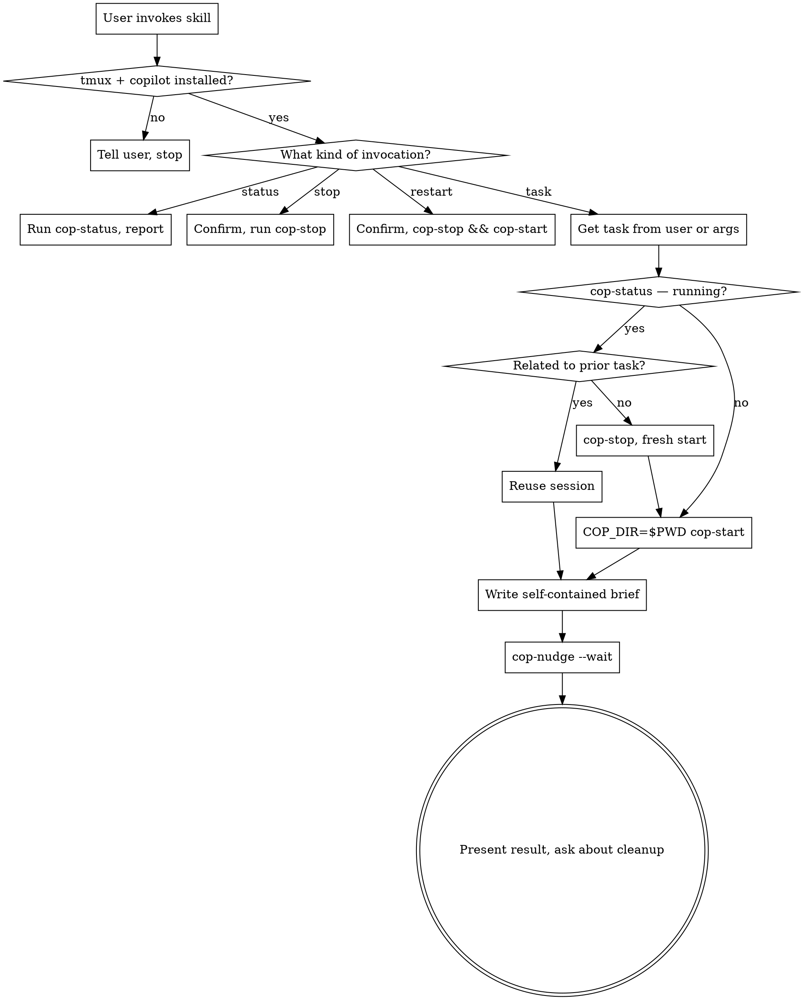

# Copilot Bridge

## Overview

Drives a long-lived GitHub Copilot CLI session in a tmux pane via the `cop-*` shell scripts that ship with this skill (in `bin/`). Lets the user offload work to Copilot — typically to use a different model (`gpt-5.3-codex` by default), get a second opinion, or shift cost off the Claude subscription — without leaving this Claude Code session.

**Audience:** the user explicitly chose to invoke this. They don't need explanations of what Copilot is or pep-talks about delegation. Be terse.

## Critical: invocation discipline

This skill is **explicit-invocation only**. Triggers:

- Direct phrases: "ask copilot", "have copilot do X", "delegate to copilot", "get a second opinion from copilot", "use copilot for this"
- Slash command: `/copilot-bridge` (with or without args)
- Status/control phrases: "is copilot running?", "what's copilot doing?", "stop copilot", "kill copilot"

**Never suggest using this skill.** Do not say things like "want me to ask Copilot?" or "this might be faster with Copilot." The user has explicit control over when this runs; offering to invoke it defeats the point.

**Never use this skill to "save tokens" without being asked.** If a task is expensive, just do it (or ask if you should split it up) — don't unilaterally route work to Copilot.

## Prerequisite

Requires `tmux` and an authenticated `copilot` CLI on PATH. Verify once per session: `which tmux copilot`. If missing, tell the user and stop.

The `cop-*` scripts ship inside this skill — they are **not** symlinked onto PATH. Always invoke them by their absolute path inside the plugin. At the start of any task that needs them, resolve their location once:

```sh
# This skill's bin dir — adjust to wherever the plugin is installed.
COP_BIN="$(dirname "$(readlink -f "${BASH_SOURCE[0]:-$0}")" 2>/dev/null)/bin"
# In practice, just hardcode the absolute path to bin/ inside the plugin install.
```

For the user's local plugin (this development repo) the path is:
`/Users/kevinm/repos/kevinmatspie/claude-skills/skills/copilot-bridge/bin`

For marketplace-installed copies, the path is wherever the plugin landed under `~/.claude/` or similar; resolve via the SKILL.md location. Use `pwd` of the SKILL.md's directory + `/bin` if needed.

## Dispatch

| Invocation | Action |
|--|--|
| `/copilot-bridge` (no args) | Ask user what to delegate, then nudge |
| `/copilot-bridge <task>` | Treat args as the task, nudge directly |
| `/copilot-bridge status` | Run `bin/cop-status`, summarize |
| `/copilot-bridge stop` | Confirm, then `bin/cop-stop` |
| `/copilot-bridge restart` | Confirm, then `bin/cop-stop && bin/cop-start` |
| "ask copilot to X" / "have copilot do X" | Nudge with X |
| "is copilot running?" / "what's copilot doing?" | `bin/cop-status` |
| "stop copilot" / "kill copilot" | Confirm, then `bin/cop-stop` |

## The six scripts

All scripts live in `bin/` inside this skill. Invoke by full path.

| Script | Purpose |
|--|--|
| `cop-start` | Idempotent — starts session if not running |
| `cop-nudge --wait "prompt"` | Send prompt, block until done, print result. **Default invocation.** |
| `cop-nudge "prompt"` | Async — prints request ID for later `cop-watch` |
| `cop-watch <id>` | Block on async request |
| `cop-send-keys <key>...` | Escape hatch (Enter, C-c, Down, etc.) for stuck TUI states |
| `cop-status` | Is session running? Last 10 pane lines |
| `cop-stop` | Kill session, clean up old output files |

Env vars (export before invoking): `COP_SESSION` (default `cop`), `COP_MODEL` (default `gpt-5.3-codex`), `COP_DIR` (default `$PWD`), `COP_READY_TIMEOUT` (default `30`).

## Workflow



## Briefing Copilot

Copilot does not see this conversation. Every nudge must be self-contained. A good brief includes:

- **What to do** (one clear task)
- **Where the relevant files are** (absolute paths or paths relative to `COP_DIR`)
- **What conventions/constraints apply** (relevant repo style, language, frameworks)
- **Desired output shape** (e.g., "prioritized list", "markdown table", "diff suggestion")

Treat each nudge like briefing a smart colleague who just walked in. Terse command-style prompts produce shallow generic work — same rule as briefing a subagent.

If the user gives you a task in plain language ("ask copilot to review the auth middleware"), expand it into a proper brief before nudging. Don't pass through "review the auth middleware" verbatim — Copilot has no idea which file or what to look for.

## Working dir gotcha

`COP_DIR` is captured by `cop-start` **at session-start time**. If the session is already running from a different directory, Copilot won't have access to the current working dir's files. When in doubt:

```sh
bin/cop-status  # check session is in the right dir context
# If wrong dir or unsure:
bin/cop-stop && COP_DIR="$PWD" bin/cop-start
```

For a fresh start, always: `COP_DIR="$PWD" bin/cop-start`.

## Reuse vs. fresh start

Copilot retains conversation context across nudges within one session. Use this:

- **Reuse** when the new ask builds on the prior one ("now also check X", "what about the test file?", "explain that suggestion further")
- **Fresh start** when switching to an unrelated task or a different repo, or when the prior session went off the rails

When unsure, ask the user briefly: "reuse existing session or start fresh?"

## Error recovery

| Symptom | Action |
|--|--|
| `cop-watch` times out | Read its stderr (last 30 pane lines + partial output). Decide: retry, `cop-send-keys` to unstick, or `cop-stop && cop-start` |
| Copilot stuck on a confirmation dialog | `cop-send-keys Down Enter` (or whatever navigates the dialog) — check `cop-status` first to see what's on screen |
| Copilot stuck on input | `cop-send-keys C-c` to cancel, then re-nudge |
| Session dead/missing | `cop-start` fresh; the user's prior context is gone, brief from scratch |

For unclear failures, attach to inspect: `tmux attach -t cop` (detach with `C-b d`). Mention this to the user — they can debug interactively.

## Output handling

When Copilot returns its result, **present it largely as-is**, with a one-line framing ("From Copilot (gpt-5.3-codex):" or similar). Do not re-summarize or paraphrase Copilot's output — the user explicitly chose to ask Copilot, not you. Format adjustments (markdown rendering) are fine; rewriting is not.

If Copilot's answer seems wrong, flag it briefly ("Note: Copilot suggests X, but your file Y actually does Z — worth double-checking") rather than silently substituting your own answer.

## Cleanup etiquette

After delivering Copilot's result, ask the user whether to leave the session running (for follow-ups) or `cop-stop`. Default to **asking, not auto-killing** — the session is cheap to keep alive and the user may want to nudge again.

If the user has clearly moved on to unrelated work for several turns and the session is just sitting idle, it's fine to mention "copilot session still running, want me to stop it?" once — but don't nag.

## Don'ts

- Don't suggest using this skill when the user hasn't asked.
- Don't use it for tasks under ~2 minutes of your own work — overhead isn't worth it.
- Don't pass secrets, credentials, or files the user hasn't OK'd into a Copilot prompt. Copilot is a separate service with its own logging/data policies.
- Don't use it for tasks that need our conversation context — if the brief would be longer than just doing the work, don't bother.
- Don't auto-kill the session. Ask first.
- Don't paraphrase Copilot's output. Pass it through.
- Don't symlink the scripts onto PATH. Always invoke by path inside the plugin.
