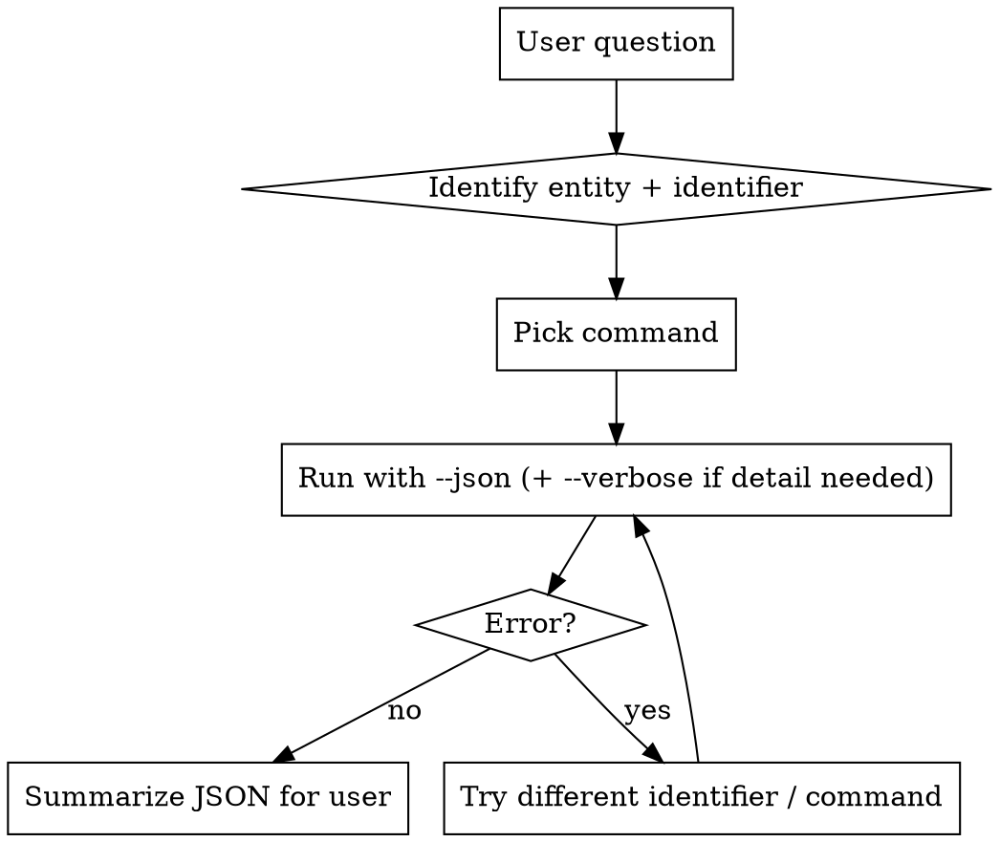

# SPIE CRM Lookup

## Overview

Answer natural-language questions about the SPIE CRM by invoking the `spie` CLI with `--json` and parsing structured output. Audience is SPIE engineers who already know SPIE's event/symposium/conference/session vocabulary — don't over-explain.

## Prerequisite

The `spie` binary must be on PATH. Verify once per session with `which spie`. If missing, tell the user the skill requires `spie-cli` to be installed and stop.

## Core rules

- **Always pass `--json`.** Never parse the formatted/colored table output.
- **Pass `--verbose` when the user needs detail** that isn't in the default output: chairs for a conference, presentations/roles for a session, authors for a paper, exhibit list for a symposium, contact email for a badge, etc. Default output stays lean.
- **Don't ask for clarification before trying.** Make the best guess at which command + identifier applies and run it; if the CLI returns an error, iterate. Faster than a clarifying round-trip.
- **Don't invent flags.** The commands below are the full set. If unsure, run `spie <cmd> --help`.
- **Default environment is `dev`**, but a user-configured default may override that (check `spie config` if it matters). Honor explicit cues: "in test", "on prod" → pass `--env test` or `--env prod`.
- **Error shape is `{"error": "..."}`.** If you see this, surface the message to the user and try a different identifier shape before giving up.
- **SPIE codes trigger this skill.** Bare codes like `PW26`, `EOD26`, `BO100`, `13292-11` are SPIE identifiers even without "SPIE" in the question.

## Efficient querying

The point of this skill is to beat a CRM Advanced Find or a hand-written SQL query on speed. Stay lean:

- **One CLI call per question** when possible. Don't pre-flight with `head -c`, `--help`, or schema checks — just run the real query.
- **Don't re-pipe the same JSON through multiple `jq` passes.** Pick one filter and run it once. If you need several fields, compute them in a single `jq` expression or (better) just read the raw JSON.
- **For counts, pipe to `jq length`.** `spie exhibitor PW26 --json | jq length` — no object wrapping, no extra aggregation.
- **For lists (any length), format in the response, not via shell.** Once the JSON is back from the CLI, Claude already has the data in context — write the markdown list directly in the answer. Do **not** `jq -r` a formatted string and expect the user to see it; Claude Code truncates long `Bash` stdout in the UI (user has to hit ctrl-o), so the list often appears delivered but is invisible. Never write to `/tmp` and Read it back as a workaround.
- **Skip `jq` entirely** when the raw JSON already answers the question (single-record lookups, or lists short enough to just read).

## Workflow



## Command reference

All commands support these global flags: `--json`, `--verbose` (`-v`), `--env <dev|test|prod>` (`-e`). Arguments accept GUID, event ID, or a smart-resolved domain identifier (SPIE code, email, paper number, etc.).

### Entity map

| User mentions… | Command | Minimal args |
|---|---|---|
| A symposium (PW26, EOD26, AS26, …) or sub-symposium (PW26B, AVR26, …) | `spie symposium <query>` | 1 |
| A person (email, web username, SPIE ID, GUID) | `spie person <query>` | 1 |
| A registration ("is X registered for Y") | `spie registration <symposium> <person>` | 2 |
| A badge number at a symposium | `spie badge <symposium> <badge>` | 2 |
| Exhibitors at a show (list or one company) | `spie exhibitor <symposium> [<query>]` | 1–2 |
| A paper/presentation (13292-11, PC13823-1, title) | `spie paper <query>` | 1 |
| A conference (list all at symposium, or one by code) | `spie conference <symposium> [<conference>]` | 1–2 |
| A session (by symposium+conference+number, or event ID) | `spie session <symposium> <conference> <query>` | 3 |

Aliases: `sym`/`symposium`, `contact`/`person`, `reg`/`registration`, `ex`/`exhibitor`, `pres`/`presentation`/`paper`, `conf`/`conference`, `sess`/`session`.

### Smart-resolution rules

- **Symposium code** — 2-4 letters + 2 digits (+ optional 1-letter suffix): `PW26`, `EOD26`, `AS26`, `PW26B`, `AVR26`.
- **Conference code** — letters + digits, usually 5 chars: `BO100`, `OSD06`, `AL101`. Always scoped under a symposium.
- **Paper number** — `<conf#>-<seq>`, e.g. `13292-11`; may have `PC` prefix for late/prerecorded: `PC13823-1`.
- **Session** — composed as `<conf#>-<seq>`, e.g. `13823-1`. Not directly resolvable by that string; look up via `spie session <symposium> <conference> <sessionNumber>` (the symposium may be the parent, e.g. `PW26`, or a sub-symposium like `PW26B` — the CLI resolves either) or by event ID.
- **Event ID** — integer (typically 7 digits, e.g. `8100174`). Works as a direct identifier on most commands.
- **SPIE ID** — integer person identifier (e.g. `4284005`).
- **Badge number** — integer, 6 digits (e.g. `388526`). Always paired with a symposium.
- **Email / web username** — natural form; `kevinm@spie.org` or `kevinmatspie`.
- **GUID** — full 36-char UUID; works anywhere an entity accepts one.

### Choosing default vs. verbose

Default output is enough for:
- "Where is PW26?" → `spie symposium PW26 --json`
- "Who is badge 388526 at PW26?" → `spie badge PW26 388526 --json`
- "What conferences are at EOD26?" → `spie conference EOD26 --json`

Use `--verbose` when the user's question requires nested data:
- **symposium** verbose → sub-symposiums + exhibitions list
- **person** verbose → extra contact detail (same schema, richer fields)
- **conference** verbose → `sessions[]` + `chairs[]`
- **session** verbose → `roles[]` (chairs/organizers) + `presentations[]`
- **paper** verbose → authors with emails/SPIE IDs
- **exhibitor** verbose → booths already included, but verbose adds booth-staff detail where present
- **registration**/**badge** verbose → expanded contact fields (e.g. email)

Only climb to verbose when you actually need those fields; it's significantly more data.

## JSON shape cheat sheet

Non-exhaustive — just enough to know what to extract without a second round trip.

**`spie symposium PW26 --json`** → object: `{uniqueIdentifier, eventId, code, name, city, state, country, venue, startDate, endDate, webStatus, timezone, location, subSymposiums[], exhibitions[]}`. `subSymposiums[]` is populated only in `--verbose`.

**`spie person kevinm@spie.org --json`** → object: `{uniqueIdentifier, spieId, email, webUsername, firstName, lastName, company, jobTitle, phone, gender, profile}`.

**`spie registration PW26 <person> --json`** and **`spie badge PW26 388526 --json`** → same shape:
```
{
  symposium: { code, name, eventId },
  contact:   { firstName, lastName, spieId },
  registrations: [ { uniqueIdentifier, symposiumCode, badgeFirstName, badgeLastName, badgeCompany, badgeNumber, category, technicalPass, registrationType, registeredOn, badgeName, status, confirmationLevel } ]
}
```

**`spie conference PW26 [code] --json`** → array of conferences: `{uniqueIdentifier, eventId, conferenceCode, programDisplayNumber, conferenceNumber, title, symposiumCode, room, startDateTime, endDateTime, callForPapersUrl, sessions[], chairs[]}`. `sessions[]` and `chairs[]` populate under `--verbose`.

**`spie session <sym> <conf> <num> --json`** → array of sessions: `{uniqueIdentifier, eventId, sessionNumber, title, room, startDateTime, endDateTime, duration, conferenceCode, conferenceTitle, conferenceNumber, symposiumCode, sessionId, sessionType, roles[], presentations[], presentationCount}`. `roles[]` and `presentations[]` populate under `--verbose`.

**`spie paper <query> --json`** → array of papers: `{uniqueIdentifier, paperNumber, trackingNumber, eventId, title, conferenceCode, conferenceTitle, symposiumCode, startDateTime, duration, primaryAuthor, contactAuthor, abstractSubmissionDate, publicationDate, status, presentationType}`. Title searches return many rows; narrow by conference or symposium when possible.

**`spie exhibitor <sym> [<query>] --json`** → array of exhibitors: `{uniqueIdentifier, spieExhibitorId, companyName, accountName, exhibitionName, symposiumCode, cancelled, confirmed, primaryContact*, website, city, country, phone, technicalPasses, displayName, location, exhibitType, confirmationLevel, booths[]}`. Omit the query to list every exhibitor at the show (large).

Field notes for exhibitors:
- `cancelled: true` means the booking was pulled — exclude from "active exhibitors" counts.
- Don't volunteer `confirmed` in summaries unless the user specifically asks about it.
- `confirmationLevel` (string) is the human-readable status; `"Confirmed"` is typical.
- `booths[]` is present for assigned exhibitors; empty for pending.

## Common question patterns

| Question | Command |
|---|---|
| "What's PW26?" / "When is PW26?" | `spie symposium PW26 --json` |
| "What sub-events are part of PW26?" | `spie symposium PW26 --verbose --json` |
| "Who is kevinm@spie.org?" | `spie person kevinm@spie.org --json` |
| "Is Kevin registered for PW26?" | `spie registration PW26 kevinm@spie.org --json` |
| "Who has badge 388526 at PW26?" | `spie badge PW26 388526 --json` |
| "Email for badge 388526 at PW26?" | `spie badge PW26 388526 --verbose --json` |
| "What conferences are happening at EOD26?" | `spie conference EOD26 --json` |
| "Who chairs BO100 at PW26?" | `spie conference PW26 BO100 --verbose --json` → read `chairs[]` |
| "What sessions are in BO100?" | `spie conference PW26 BO100 --verbose --json` → read `sessions[]` |
| "Who chairs session 1 of BO100?" | `spie session PW26 BO100 1 --verbose --json` → read `roles[]` |
| "Papers in session 13823-1" | `spie session PW26 BO100 1 --verbose --json` → read `presentations[]` |
| "Show me paper 13292-11" | `spie paper 13292-11 --json` |
| "Find papers about quantum dots" | `spie paper --title "quantum dots" --json` |
| "Is 2b-special exhibiting at PW26?" | `spie exhibitor PW26 "2b-special" --json` |
| "List all exhibitors at PW26" | `spie exhibitor PW26 --json` → render list in response |
| "How many exhibitors at PW26?" | `spie exhibitor PW26 --json \| jq length` |
| "How many active exhibitors at PW26?" | `spie exhibitor PW26 --json \| jq '[.[] \| select(.cancelled \| not)] \| length'` |

## Responding to the user

- Summarize the JSON; don't dump it. Users want "Kevin Mills, badge 388526, Exhibitor category, registered 2025-12-24", not the raw object.
- Include the key identifiers (SPIE ID, badge #, event ID, paper #) when relevant so the user can pivot to another lookup.
- **When the user asks for a list, render it in your response as a markdown list** built from the JSON you already have. Do not rely on shell-formatted output reaching the user — Claude Code truncates long `Bash` stdout (the user has to hit ctrl-o to expand), so a `jq -r` pretty-print often looks delivered but isn't visible.
- For long lists, render everything (or the top N with a total count) in the response text; offer to narrow with a follow-up filter.
- Quote the command you ran so the user can repeat or adjust it.
- For cross-environment answers, state which environment you queried.
